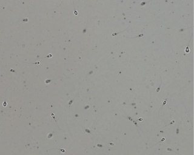
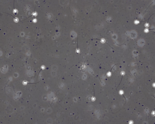
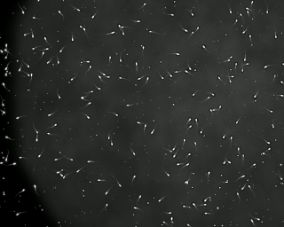

# AndroGen – Synthetic Sperm Image Generator

 **AndroGen** is an open-source synthetic data generation tool for automated sperm analysis from microscopic images. It allows researchers to generate highly customizable datasets without relying on real data or training generative models.

## ✨ Key Features

- 📷 Synthetic generation of microscopic sperm images for multiple animal species.
- 🔧 Intuitive GUI with preloaded dataset configurations (SVIA, VISEM, BOSS).
- ⚙️ Full customization: morphology, concentration, movement, background, and debris.
- 🖥️ Compatible with both local and cloud environments via Gradio.
- 📂 Exports datasets with images, segmentation masks, and annotations (PNG, TXT).
- 🧪 Quantitatively and qualitatively validated using FID/KID metrics.
- 🧬 Modular and extensible: easily add new species, environments, motion patterns, and artifacts.

## 📦 Installation and 🚀 Usage

```bash
git clone https://github.com/dhernandezgit/AndroGen.git
cd AndroGen
./launch.sh
```

From the GUI, you can:

1. Load predefined configurations based on SVIA, VISEM, or BOSS datasets.
2. Adjust visual parameters: background, brightness, contrast, blur, color, depth distribution.
3. Define morphology: species, spermatozoa classes, dimensions, mobility, and more.
4. Generate customized images or sequences and save them to your target directory.

## 📈 Validation

AndroGen has been validated by replicating SVIA, VISEM, and BOSS datasets. Synthetic images were evaluated with:

- **FID (Frechet Inception Distance)**
- **KID (Kernel Inception Distance)**

Results show strong similarity to real datasets at low computational cost and without real data.


| SVIA Synthetic | VISEM Synthetic | BOSS Synthetic |
|----------------|-----------------|----------------|
|  |  |  |


# License
**AGPL-3.0 License**: This open-source license is ideal for students and researchers, promoting open collaboration and knowledge sharing. See the LICENSE file for more details.

**Enterprise License**: Designed for commercial use, this license permits using this software for commercial solutions, bypassing the open-source requirements of AGPL-3.0. Please contact us for more details.

## 👥 Authors

- Daniel Hernández-Ferrándiz  - `daniel.hernandezf@urjc.es`
- Juan J. Pantrigo -`juanjose.pantrigo@urjc.es`
- Soto Montalvo  - `soto.montalvo@urjc.es`
- Raúl Cabido  - `raul.cabido@urjc.es`

Universidad Rey Juan Carlos, Móstoles, Spain
